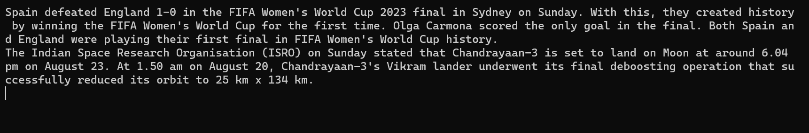

# Installition 
```sh
git clone
pip install -r requirements.txt
```
# About
I wrote this program when i was bored so basically its a cli news app so when you run this code it will fetch news api by [Sumit Khole](https://github.com/sumitkolhe/) and read the top news for you using python text to speech


# LICENCE

GPL - 3.0